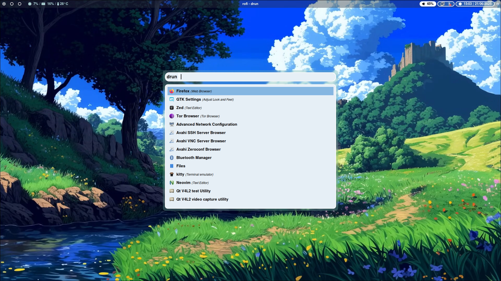
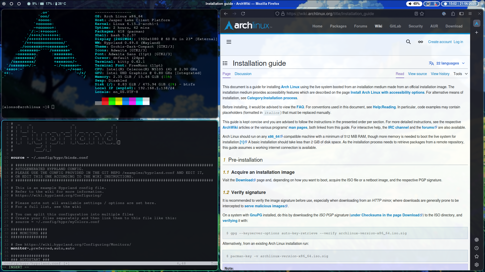

# Hypr-Desktop

Just my dotfiles. This setup is design to be lightweight, minimal and easy to maintain and modify. Great for a begginer to use as a base or for a more experience users that don't want the bloat of a fully riced desktop enviroment.

## Screenshots

## Installation
At the moment the installation should be done manually by cloning the repo and putting it in your .config folder. See Requierements section to check wich programs are needed.

## Requirements
- Basics: hyprland, dunst, pipewire, xdg-desktop-portal-hyprland, hyprpolkitagent, qt5-wayland and qt6-wayland. (Just follow the [hyprland wiki](https://wiki.hypr.land/Useful-Utilities/Must-have/))
- Status bar: [Waybar](https://github.com/Alexays/Waybar/wiki/Module:-Hyprland)
- [hyp-ecosistem](https://wiki.hypr.land/Hypr-Ecosystem/): [hyprpaper](https://wiki.hypr.land/Hypr-Ecosystem/hyprpaper/), [hypridle](https://wiki.hypr.land/Hypr-Ecosystem/hypridle/) and [hyprlock](https://wiki.hypr.land/Hypr-Ecosystem/hyprlock/)
- [Bluethoot](https://wiki.archlinux.org/title/Bluetooth): bluez, bluez-utils and blueman (require manual configuration through the terminal in Arch)
- [NetworkManager](https://wiki.archlinux.org/title/NetworkManager): networkmanager and network-manager-applet
- Screenshots: grim, slurp and swappy
- Theming (optional): nwg-look, materia-gtk-theme and sddm-sugar-candy-git

